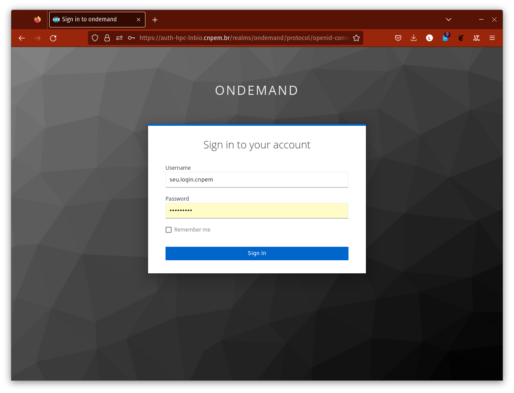

# Primeiros passos

Para ativar seu usuário no HPCC Marvin, é necessário fazer um primeiro acesso via `ssh` (Secury SHell), protocolo de rede seguro que permite a comunicação com servidores remotos. 

## Primeiro acesso 🚪

O primeiro acesso ao HPC Marvin é feito através do terminal </img> (Linux ou MacOS) ou do PowerShell </img> (Windows). Para isso, use o seguinte comando:

```bash
ssh <seu.login.cnpem>@marvin.cnpem.br
```

<div class="warning">
Se você é a Marie Skłodowska-Curie, seu e-mail institucional é <code>marie.curie@lnbio.cnpem.br</code>. Logo, seu usuário é <code>marie.curie</code>. Sempre que encontrar <code>&lt;seu.login.cnpem&gt;</code>, digite <code>marie.curie</code>.
</div>


Quando solicitado, digite sua **senha institucional**.

Você pode receber um aviso solicitando sua confirmação antes de continuar conectando.

```bash
[...] Are you sure you want to continue connecting (yes/no/[fingerprint])?
```

Digite `yes` e pressione **enter**. Se tudo correu bem, você verá o cursor piscando no terminal, com um texto semelhante a:

```bash
[<seu.login.cnpem>@marvin ~]$
```

<div class="warning">

Após o primeiro login, você já poderá ler e gravar arquivos na aba <code>Files</code> do Open OnDemand (OOD), porém <strong>ainda não terá permissão para criar jobs, submeter tarefas ao SLURM ou utilizar os <code>Interactive Apps</code></strong>.

Essa autorização é concedida manualmente. Para solicitá-la, registre um chamado na <a href="https://cnpem.atlassian.net/servicedesk/customer/portal/181" target="_blank">[LNBio] Suporte EDB</a> do Jira em <a href="https://cnpem.atlassian.net/servicedesk/customer/portal/181/group/536/create/2155" target="_blank">HPCC Marvin: Suporte ao usuário</a>.

</div>

Se estiver no Windows e receber o seguinte erro, solicite ao TIC para instalar o `ssh` ou tente usar outro computador.

```PowerShell
ssh: O termo 'ssh' não é reconhecido como nome de cmdlet, função, arquivo de script
ou programa operável. Verifique a grafia do nome ou, se um caminho tiver sido incluído,
veja se o caminho está correto e tente novamente.
Na linha:1 caractere:1
+ ssh marie.curie@marvin.cnpem.br
+ ~~~
    + CategoryInfo          : ObjectNotFound (ssh:String) [], CommandNotFoundException
    + FullyQualifiedErrorId : CommandNotFoundException
```

## Acesso pelo navegador </img>

Para acessar o HPCC Marvin pelo navegador, abra seu navegador e acesse:

```browser
https://marvin.cnpem.br
```

<div class="warning">

Lembre-se que este endereço só funcionará na rede interna do CNPEM. Para acessá-lo de fora do centro, é necessário usar a <strong>VPN</strong>. Caso não tenha este acesso à VPN, entre em contato com o <strong>DTI</strong>.

</div>

Na tela de login, use seu usuário (sem `@lnbio.cnpem.br`) e senha institucional.

<center>
    
</center>

Após o login, você verá a interface principal do Open OnDemand:

<center>
    
</center>

## Vídeo resumo

Abaixo, você pode ver um vídeo que resume os primeiros acesso ao HPCC Marvin, tanto pelo terminal quanto pelo navegador.

<figure class="video_container">
  <video controls="true" allowfullscreen="true" poster="videos/thumb_1st.png" width="852" height="480">
    <source src="videos/1stlogin.mp4" type="video/mp4">
  </video>
</figure>

Se você tiver alguma dúvida ou precisar de ajuda, não hesite em entrar em contato com a equipe de suporte do sistema.
