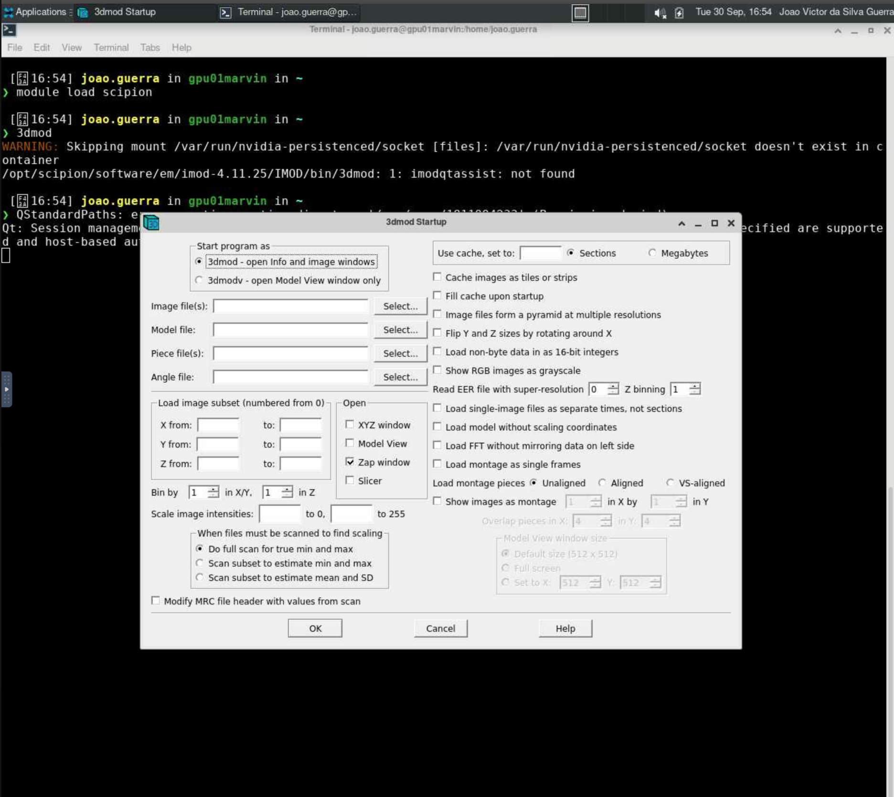

# 3dmod

O [3dmod](https://bio3d.colorado.edu/imod/) é um programa de visualização e modelagem de dados de microscopia eletrônica em 3D. Ele faz parte do pacote IMOD, que é amplamente utilizado para a análise e reconstrução de imagens de tomografia eletrônica.

Para mais informações sobre o 3dmod, acesse <https://bio3d.colorado.edu/imod/doc/3dmodguide.html>.

## Carregando o módulo

O 3dmod está disponível dentro do módulo `scipion/3.8.3`. Para utilizá-lo no HPCC Marvin, você deve carregar o módulo `scipion/3.8.3`:

```bash
module load scipion/3.8.3
```

Para acessar a documentação do modulo, utilize:

```bash
module help scipion/3.8.3
```

## Como executar o 3dmod no Open OnDemand

Para executar o 3dmod, são necessários os seguintes passos:

1. Acesse o Open OnDemand do HPCC Marvin em <https://marvin.cnpem.br/>.

2. Em `Interactive Apps`, abra uma `VNC`.

3. No formulário da VNC, selecione uma das partições `gui-gpu-small` ou `gui-gpu-big` e defina o número de horas, número de GPUs e número de CPUs conforme necessário. Clique em `Launch`.

4. Uma nova janela será aberta com a VNC. Aguarde até que a VNC esteja ativa (`Running`) e clique em `Launch VNC`.

5. Uma vez que a VNC estiver ativa, abra um terminal dentro da VNC.

6. No terminal, execute o seguinte comando para iniciar o 3dmod:

```bash
# Habilitar o módulo
module load scipion/3.8.3
# Iniciar o 3dmod com interface gráfica
3dmod
```

<center>
    
</center>

Para mais detalhes sobre os parâmetros do 3dmod, use:

```bash
3dmod -h
```