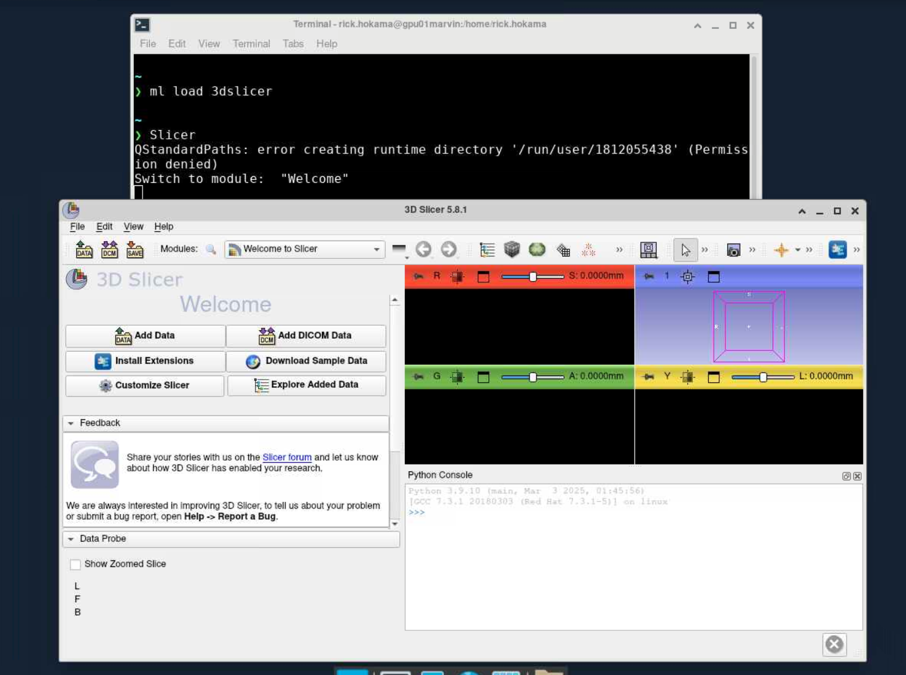

# 3D Slicer

O [3D Slicer](https://www.slicer.org/) é uma plataforma de código aberto para análise e visualização de imagens médicas em 3D. Ele oferece ferramentas avançadas para segmentação, reconstrução, registro e modelagem anatômica, sendo amplamente utilizado em pesquisa biomédica, planejamento cirúrgico e aplicações clínicas.

Para mais informações, consulte a documentação oficial do 3D Slicer: <https://slicer.readthedocs.io/en/latest/>.

## Carregando o módulo

Para habilitar o 3D Slicer no Marvin, você deve carregar o módulo `3dslicer`
```bash
module load 3dslicer/5.8.1
```

Para acessar a documentação do modulo, utilize:

```bash
module help 3dslicer/5.8.1
```

## Como executar o 3D Slicer no Open OnDemand

Para executar o 3D Slicer, são necessários os seguintes passos:

1. Acesse o Open OnDemand do HPCC Marvin em <https://marvin.cnpem.br/>.

2. Em `Interactive Apps`, abra uma `VNC`.

3. No formulário da VNC, selecione uma das partições `gui-gpu-small` ou `gui-gpu-big` e defina o número de horas, número de GPUs e número de CPUs conforme necessário. Clique em `Launch`.

4. Uma nova janela será aberta com a VNC. Aguarde até que a VNC esteja ativa (`Running`) e clique em `Launch VNC`.

5. Uma vez que a VNC estiver ativa, abra um terminal dentro da VNC.

6. No terminal, execute o seguinte comando para iniciar o 3D Slicer:

```bash
# Habilitar o módulo
module load 3dslicer/3.8.3
# Iniciar o 3dslicer com interface gráfica
Slicer
```

<center>
    
</center>

Para mais detalhes sobre os parâmetros do 3D Slicer, use:

```bash
Slicer --help
```
