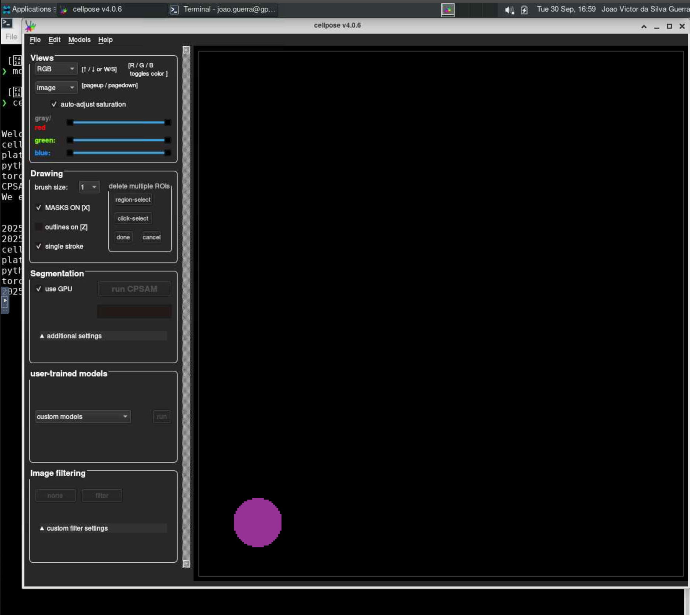

# Cellpose

O [Cellpose](https://github.com/MouseLand/cellpose) é um modelo de segmentação de células baseado em aprendizado profundo, projetado para ser versátil e fácil de usar. Ele pode segmentar uma ampla variedade de tipos de células e tecidos sem a necessidade de treinamento específico para cada tipo.

Para mais informações sobre o Cellpose, acesse <https://cellpose.org/>.

## Carregando o módulo

Para habilitar o Cellpose no HPCC Marvin, você deve carregar o módulo `cellpose`:

```bash
module load cellpose
```

<div class="warning">
    <br>As versões disponíveis do Cellpose no HPCC Marvin são:
    <ul>
        <li><code>cellpose/4.0.6    (D)</code></li>
        <li><code>cellpose/3.1.1.2     </code></li>
        <li><code>cellpose/2.3.2       </code></li>
    </ul>
    Onde <code>(D)</code> indica a versão padrão.<br>
</div>

Para acessar a documentação do modulo, utilize:

```bash
module help cellpose
```

## Executando o Cellpose com interface gráfica (GUI)

A execução do Cellpose no HPCC Marvin é feita por meio de uma sessão VNC (Virtual Network Computing) utilizando o Open OnDemand. Para isso, siga os passos abaixo:

1. Acesse o Open OnDemand do HPCC Marvin em <https://marvin.cnpem.br/>.

2. Em `Interactive Apps`, abra uma `VNC`.

3. No formulário da VNC, selecione a partição `gui-gpu-small` e defina o número de horas, número de GPUs e número de CPUs conforme necessário. Clique em `Launch`.

4. Uma nova janela será aberta com a VNC. Aguarde até que a VNC esteja ativa (`Running`) e clique em `Launch VNC`.

5. Uma vez que a VNC estiver ativa, abra um terminal dentro da VNC.

6. No terminal, execute o seguinte comando para iniciar o Cellpose:

```bash
# Habilitar o módulo
module load cellpose
# Iniciar o Cellpose com interface gráfica
cellpose
```

<center>
    
</center>

## Submetendo jobs do Cellpose

O Cellpose também pode ser executado via submissão de jobs no SLURM, permitindo análises em segundo plano e melhor aproveitamento dos recursos do cluster. Crie um arquivo de script, por exemplo `cellpose.sh`, com o seguinte conteúdo:

```bash
#!/bin/bash
#SBATCH --job-name=cellpose
#SBATCH --partition=short-gpu-small 
#SBATCH --ntasks=1
#SBATCH --cpus-per-task=4
#SBATCH --mem-per-cpu=2GB
#SBATCH --gres=gpu:1g.5gb:1

module load cellpose

cellpose <parâmetros do cellpose>
```

Por exemplo, para segmentar imagens em uma pasta de entrada e salvar os resultados em uma pasta de saída, você pode usar:

```bash
cellpose --dir /home/carsen/images_cyto/test/ --save_png
```

Para mais detalhes sobre todos os parâmetros do Cellpose, use:

```bash
cellpose --help
```

Para submeter o job, salve o script e utilize o comando `sbatch`:

```bash
sbatch cellpose.sh
```

## Uso via Python (scripting)

O Cellpose também pode ser usado diretamente em scripts Python, permitindo automatizar análises e integrá-las a pipelines:

```python
import numpy as np
import matplotlib.pyplot as plt
from cellpose import models, io
from cellpose.io import imread

io.logger_setup()

model = models.CellposeModel(gpu=True)

# list of files
# PUT PATH TO YOUR FILES HERE!
files = ['/media/carsen/DATA1/TIFFS/onechan.tif']

imgs = [imread(f) for f in files]
nimg = len(imgs)

masks, flows, styles = model.eval(imgs)
```
