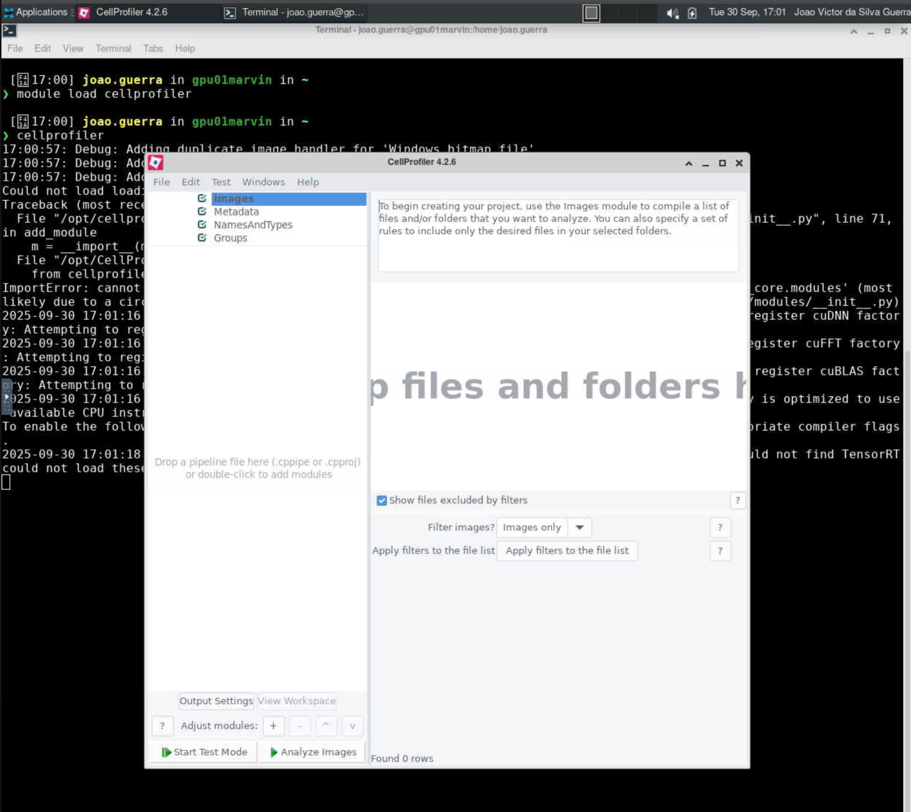

# Cellprofiler

O [CellProfiler](https://github.com/CellProfiler/CellProfiler) é um programa de código aberto amplamente utilizado para análise de imagens biológicas. Ele permite a quantificação de características celulares em imagens, facilitando a análise de grandes conjuntos de dados.

Para mais informações sobre o CellProfiler, acesse <https://cellprofiler.org/>.

## Carregando o módulo

Para habilitar o CellProfiler no HPCC Marvin, você deve carregar o módulo `cellprofiler`:

```bash
module load cellprofiler
```

<div class="warning">
    <br>As versões disponíveis do CellProfiler no HPCC Marvin são:
    <ul>
        <li><code>cellprofiler/4.2.6    (D)</code></li>
        <li><code>cellprofiler/4.2.4</code></li>
    </ul>
    Onde <code>(D)</code> indica a versão padrão.<br>
</div>

Para acessar a documentação do modulo, utilize:

```bash
module help cellprofiler
```

## Executando o CellProfiler com interface gráfica (GUI)

A execução do CellProfiler no HPCC Marvin é feita por meio de uma sessão VNC (Virtual Network Computing) utilizando o Open OnDemand. Para isso, siga os passos abaixo:

1. Acesse o Open OnDemand do HPCC Marvin em <https://marvin.cnpem.br/>.

2. Em `Interactive Apps`, abra uma `VNC`.

3. No formulário da VNC, selecione a partição `gui-gpu-small` e defina o número de horas, número de GPUs e número de CPUs conforme necessário. Clique em `Launch`.

4. Uma nova janela será aberta com a VNC. Aguarde até que a VNC esteja ativa (`Running`) e clique em `Launch VNC`.

5. Uma vez que a VNC estiver ativa, abra um terminal dentro da VNC.

6. No terminal, execute o seguinte comando para iniciar o CellProfiler:

```bash
# Habilitar o módulo
module load cellprofiler
# Iniciar o CellProfiler com interface gráfica
cellprofiler
```

<center>
    
</center>

<div class="warning">
   <br>Para conjuntos de dados muito grandes, recomenda-se utilizar a CLI do CellProfiler (sem interface gráfica) para obter melhor desempenho. O uso da GUI pode ser mais lento e consumir mais recursos, resultando em travamentos ou falhas na análise.<br>
</div>

## Submetendo jobs do CellProfiler

O CellProfiler também pode ser executado via submissão de jobs no SLURM, permitindo análises em segundo plano e melhor aproveitamento dos recursos do cluster. Crie um arquivo de script, por exemplo `cellprofiler.sh`, com o seguinte conteúdo:

```bash
#!/bin/bash
#SBATCH --job-name=cellprofiler
#SBATCH --partition=short-cpu 
#SBATCH --ntasks=1
#SBATCH --cpus-per-task=4
#SBATCH --mem-per-cpu=2GB

module load cellprofiler

cellprofiler -c -r -p /path/to/your/pipeline.cppipe -o /path/to/output -i /path/to/images
```

<div class="warning">
<br>Os parâmetros utilizados nesse comando são:

- <code>-c</code>: Executa o CellProfiler em modo CLI (sem interface gráfica).
- <code>-r</code>: Executa o pipeline na inicialização.
- <code>-p</code>: Especifica o caminho para o pipeline que será executado (`pipeline.cppipe`).
- <code>-i</code>: Caminho para a pasta com as imagens de entrada.
- <code>-o</code>: Caminho para a pasta onde os resultados serão salvos.

Caso utilize módulos que demandem GPU, selecione uma partição compatível:

- `short-gpu-small`, adicione: `#SBATCH --gres=gpu:a100:1`
- `short-gpu-big`, adicione: `#SBATCH --gres=gpu:1g.5gb:1`<br>

</div>

Para submeter o job, salve o script e utilize o comando `sbatch`:

```bash
sbatch cellprofiler.sh
```

Para mais detalhes sobre os parâmetros do CellProfiler, use:

```bash
cellprofiler --help
```
