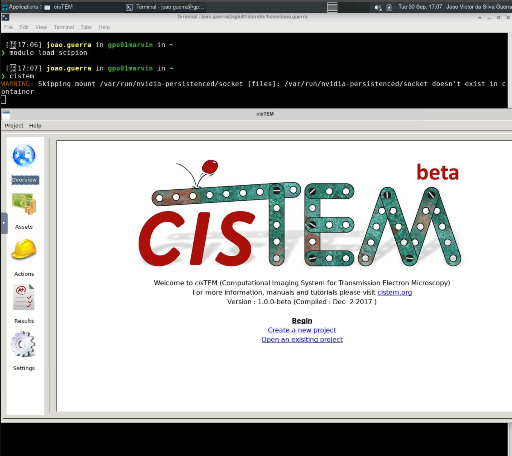

# cisTEM

O [cisTEM](https://cistem.org) (Computational Imaging System for Transmission Electron Microscopy) é um software para o processamento de imagens de criomicroscopia eletrônica (cryo-EM) de complexos macromoleculares, permitindo a obtenção de reconstruções 3D em alta resolução. O software reúne diversas ferramentas para processamento de dados de imagens — incluindo filmes, micrografias e pilhas de partículas únicas — oferecendo um pipeline completo para reconstruções de partículas únicas em alta resolução.

Para mais informações sobre o cisTEM, acesse <https://cistem.org/documentation>.

## Carregando o módulo

O cisTEM está disponível dentro do módulo `scipion`. Para utilizá-lo no HPCC Marvin, você deve carregar o módulo `scipion`:

```bash
module load scipion
```

Para acessar a documentação do modulo, utilize:

```bash
module help scipion
```

## Como executar o cisTEM no Open OnDemand

Para executar o cisTEM, são necessários os seguintes passos:

1. Acesse o Open OnDemand do HPCC Marvin em <https://marvin.cnpem.br/>.

2. Em `Interactive Apps`, abra uma `VNC`.

3. No formulário da VNC, selecione uma das partições `gui-gpu-small` ou `gui-gpu-big` e defina o número de horas, número de GPUs e número de CPUs conforme necessário. Clique em `Launch`.

4. Uma nova janela será aberta com a VNC. Aguarde até que a VNC esteja ativa (`Running`) e clique em `Launch VNC`.

5. Uma vez que a VNC estiver ativa, abra um terminal dentro da VNC.

6. No terminal, execute o seguinte comando para iniciar o Scipion:

```bash
# Habilitar o módulo
module load scipion
# Iniciar o cisTEM com interface gráfica
cistem
```

<center>
    
</center>
