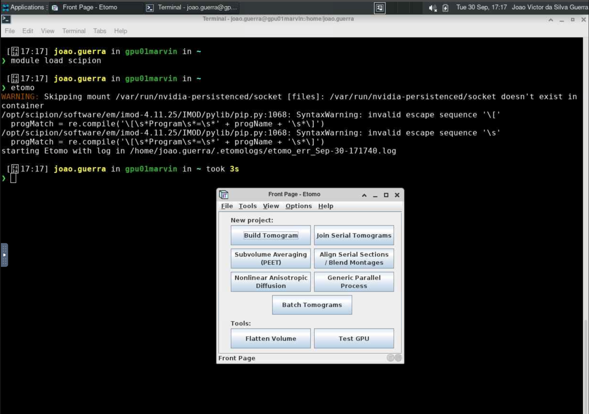

# Etomo

O [Etomo](https://bio3d.colorado.edu/imod/) é um software para a reconstrução de tomografias eletrônicas, permitindo a visualização e análise de dados de tomografia em 3D. O Etomo é parte do pacote [IMOD](https://bio3d.colorado.edu/imod/) e é amplamente utilizado na comunidade de microscopia eletrônica.

## Carregando o módulo

O Etomo está disponível dentro do módulo `scipion`. Para utilizá-lo no HPCC Marvin, você deve carregar o módulo `scipion`:

```bash
module load scipion
```

Para acessar a documentação do modulo, utilize:

```bash
module help scipion
```

## Como executar o Etomo no Open OnDemand

Para executar o Etomo, são necessários os seguintes passos:

1. Acesse o Open OnDemand do HPCC Marvin em <https://marvin.cnpem.br/>.

2. Em `Interactive Apps`, abra uma `VNC`.

3. No formulário da VNC, selecione uma das partições `gui-gpu-small` ou `gui-gpu-big` e defina o número de horas, número de GPUs e número de CPUs conforme necessário. Clique em `Launch`.

4. Uma nova janela será aberta com a VNC. Aguarde até que a VNC esteja ativa (`Running`) e clique em `Launch VNC`.

5. Uma vez que a VNC estiver ativa, abra um terminal dentro da VNC.

6. No terminal, execute o seguinte comando para iniciar o Scipion:

```bash
# Habilitar o módulo
module load scipion
# Iniciar o Etomo com interface gráfica
etomo
```

<center>
    
</center>

Para mais detalhes sobre os parâmetros do Etomo, use:

```bash
etomo --help
```