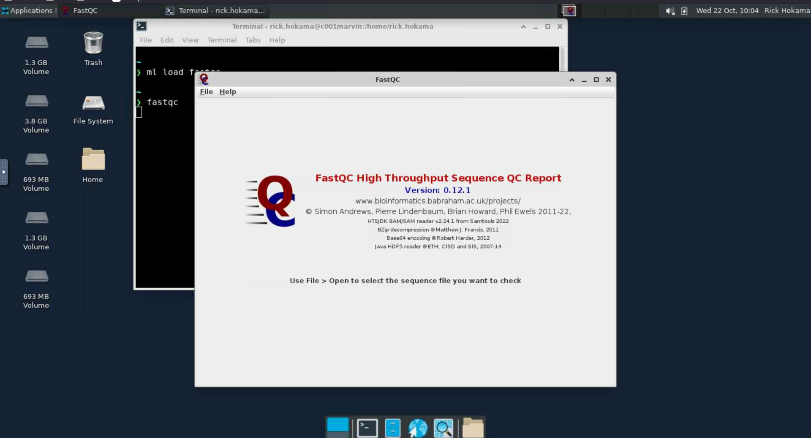

# FastQC

O [FastQC](https://www.bioinformatics.babraham.ac.uk/projects/fastqc/) é um software para **análise de controle de qualidade de dados de sequenciamento** (NGS – *Next Generation Sequencing*).  
Ele é amplamente utilizado para avaliar a qualidade de arquivos FASTQ, fornecendo uma visão geral rápida e detalhada sobre os dados antes de etapas posteriores de análise.

O FastQC gera relatórios gráficos e estatísticos que permitem identificar possíveis problemas nas leituras, como:

- Qualidade das bases ao longo das sequências  
- Conteúdo GC e distribuição de tamanhos de leitura  
- Presença de adaptadores ou contaminantes  
- Sequências duplicadas  
- *Overrepresented sequences* (sequências com frequência anormalmente alta)

Para mais informações sobre o FastQC, acesse:  
<https://www.bioinformatics.babraham.ac.uk/projects/fastqc/>

## Carregando o módulo

Para habilitar o fastqc no HPCC Marvin, você deve carregar o módulo `fastqc`:

```bash
module load fastqc 
```

<div class="warning">
    <br>As versões disponíveis do fastqc no HPCC Marvin são:
    <ul>
        <li><code>fastqc/0.12.1 (D)</code></li>
    </ul> 
    Onde <code>(D)</code> indica a versão padrão.<br>
</div>

Para acessar a documentação do modulo, utilize:

```bash
module help fastqc 
```

## Como executar o fastqc no Open OnDemand

Para executar o fastqc, são necessários os seguintes passos:

1. Acesse o Open OnDemand do HPCC Marvin em <https://marvin.cnpem.br/>.

2. Em `Interactive Apps`, abra uma `VNC`.

3. No formulário da VNC, selecione uma das partições `gui-cpu`, `gui-gpu-small` ou `gui-gpu-big` e defina o número de horas, número de GPUs e número de CPUs conforme necessário. Clique em `Launch`.

4. Uma nova janela será aberta com a VNC. Aguarde até que a VNC esteja ativa (`Running`) e clique em `Launch VNC`.

5. Uma vez que a VNC estiver ativa, abra um terminal dentro da VNC.

6. No terminal, execute o seguinte comando para iniciar o fastqc:

```bash
# Habilitar o módulo
module load fastqc/0.12.1
# Iniciar o fastqc com interface gráfica
fastqc
```

<center>
    
</center>

Para mais detalhes sobre os parâmetros do Fastqc, use:

```bash
fastqc --help
```

## Como executar o fastqc via SSH

Ao conectar remotamente no Marvin via SSH, é necessário habilitar o X11 forwarding para exibir a interface gráfica na máquina local.

```bash
# Iniciar conexão ssh habilitando X11 forwarding
ssh -X <user>@marvin.cnpem.br

# Habilitar módulo
module load fastqc/0.12.1

# Iniciar o fastqc com interface gráfica
fastqc
```
