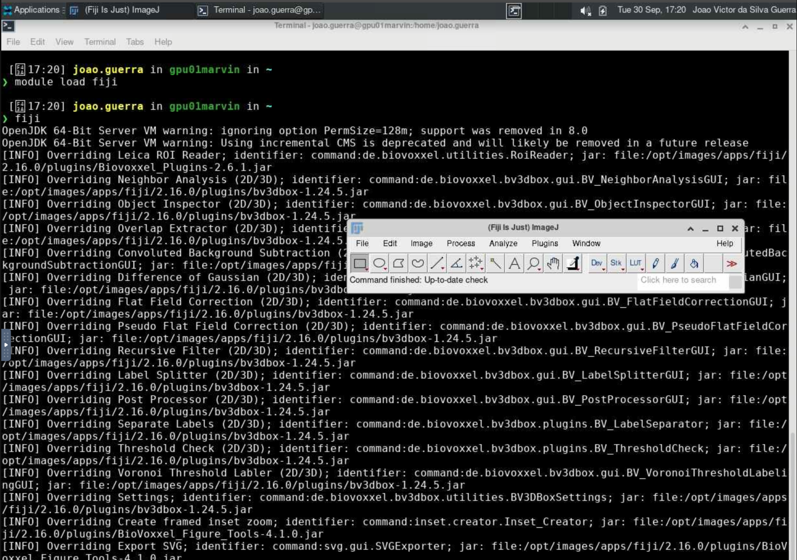

# Fiji

O [Fiji](https://github.com/fiji/fiji) (Fiji Is Just ImageJ) é uma distribuição do ImageJ, um software de código aberto amplamente utilizado para análise e processamento de imagens científicas. O Fiji inclui uma série de plugins e ferramentas adicionais que facilitam tarefas comuns em análise de imagens biológicas.

Para mais informações sobre o Fiji, acesse <https://fiji.sc/>.

## Carregando o módulo

Para habilitar o Fiji no HPCC Marvin, você deve carregar o módulo `fiji`:

```bash
module load fiji
```

<div class="warning">
    <br>As versões disponíveis do Fiji no HPCC Marvin são:
    <ul>
        <li><code>fiji/2.16.0</code></li>
    </ul>
</div>

Para acessar a documentação do modulo, utilize:

```bash
module help fiji
```

## Executando o Fiji com interface gráfica (GUI)

A execução do Fiji no HPCC Marvin é feita por meio de uma sessão VNC (Virtual Network Computing) utilizando o Open OnDemand. Para isso, siga os passos abaixo:

1. Acesse o Open OnDemand do HPCC Marvin em <https://marvin.cnpem.br/>.

2. Em `Interactive Apps`, abra uma `VNC`.

3. No formulário da VNC, selecione a partição `gui-gpu-small` e defina o número de horas, número de GPUs e número de CPUs conforme necessário. Clique em `Launch`.

4. Uma nova janela será aberta com a VNC. Aguarde até que a VNC esteja ativa (`Running`) e clique em `Launch VNC`.

5. Uma vez que a VNC estiver ativa, abra um terminal dentro da VNC.

6. No terminal, execute o seguinte comando para iniciar o Fiji:

```bash
# Habilitar o módulo
module load fiji
# Iniciar o Fiji com interface gráfica
fiji
```

<center>
    
</center>

Para mais detalhes sobre os parâmetros do Fiji, use:

```bash
fiji --help
```
