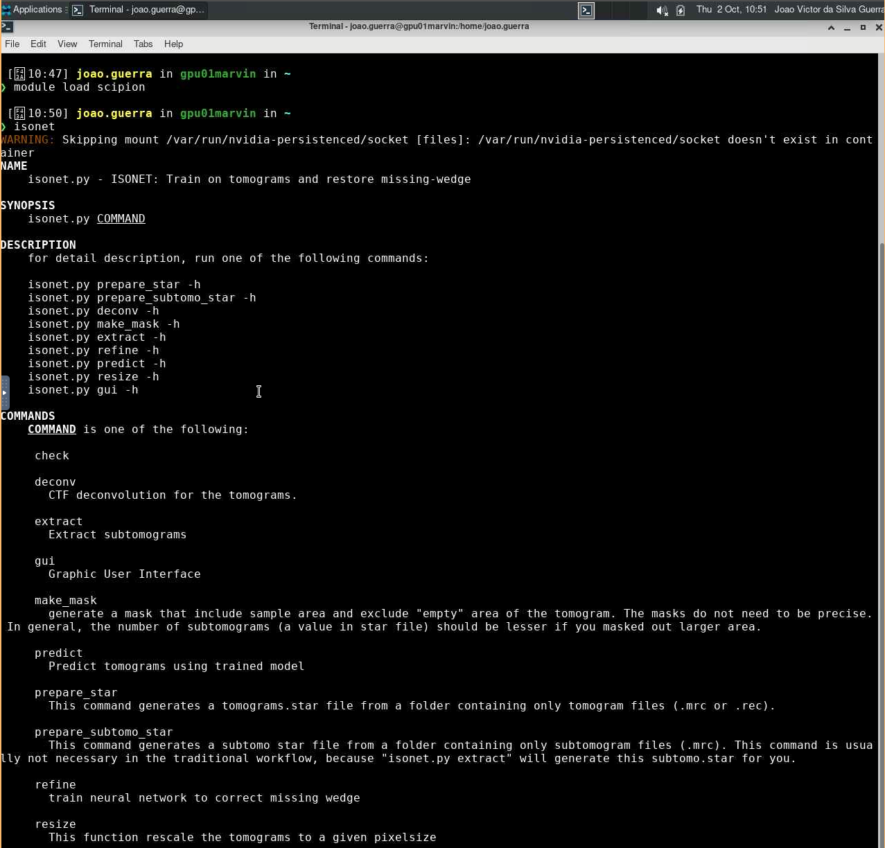
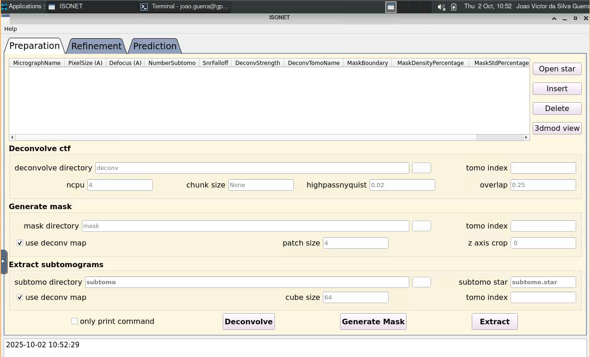

# IsoNet

O [IsoNet](https://isonetcryoet.com/) (Isotropic Reconstruction For Electron Tomography) é uma ferramenta baseada em aprendizado profundo desenvolvida para melhorar a reconstrução de volumes em tomografia eletrônica.

Para mais informações sobre o IsoNet, acesse <https://isonetcryoet.com/docs.html>. O código-fonte está disponível em <https://github.com/IsoNet-cryoET/IsoNet>.

## Carregando o módulo

O IsoNet está disponível dentro do módulo `scipion/3.8.3`. Para utilizá-lo no HPCC Marvin, você deve carregar o módulo `scipion/3.8.3`:

```bash
module load scipion/3.8.3
```

Para acessar a documentação do modulo, utilize:

```bash
module help scipion/3.8.3
```

## Como executar o IsoNet no Open OnDemand

Para executar o IsoNet, são necessários os seguintes passos:

1. Acesse o Open OnDemand do HPCC Marvin em <https://marvin.cnpem.br/>.

2. Em `Interactive Apps`, abra uma `VNC`.

3. No formulário da VNC, selecione uma das partições `gui-gpu-small` ou `gui-gpu-big` e defina o número de horas, número de GPUs e número de CPUs conforme necessário. Clique em `Launch`.

4. Uma nova janela será aberta com a VNC. Aguarde até que a VNC esteja ativa (`Running`) e clique em `Launch VNC`.

5. Uma vez que a VNC estiver ativa, abra um terminal dentro da VNC.

6. No terminal, execute o seguinte comando para iniciar o IsoNet:

```bash
# Habilitar o módulo
module load scipion/3.8.3
# Iniciar o IsoNet
isonet
```

<center>
    
</center>

```bash
# Iniciar o IsoNet com interface gráfica
isonet gui
```

<center>
    
</center>

Para mais detalhes sobre os parâmetros do IsoNet, use:

```bash
isonet --help
```
