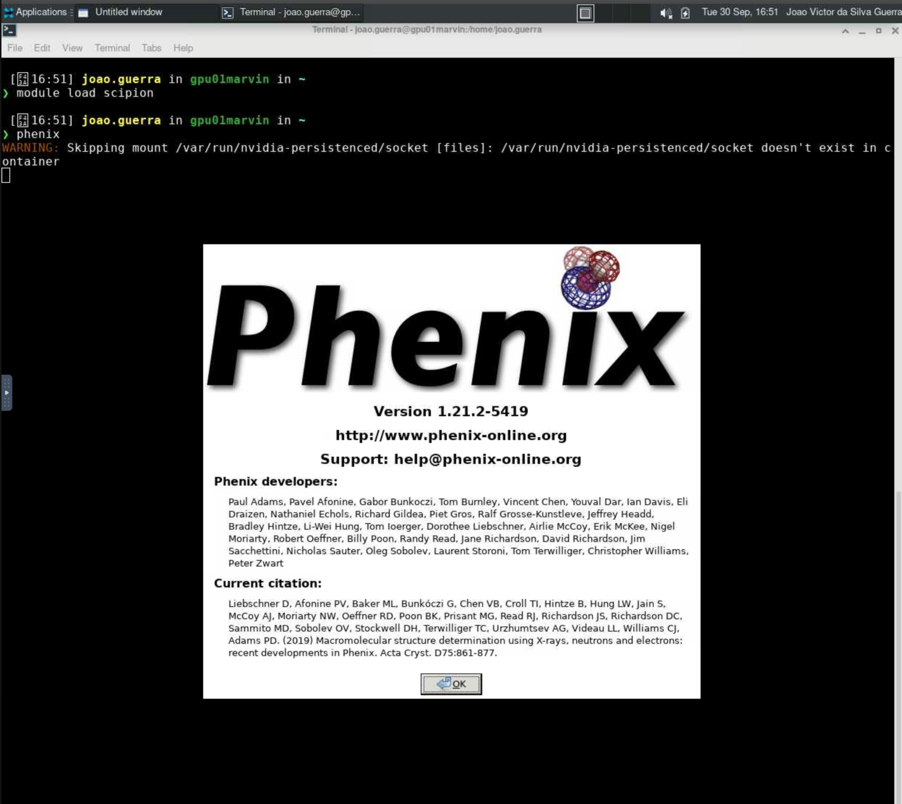

# Phenix

O [Phenix](https://phenix-online.org/) é um conjunto abrangente de ferramentas para a determinação e análise de estruturas macromoleculares, amplamente utilizado na comunidade de biologia estrutural. Ele oferece uma variedade de programas para refinamento, validação e modelagem de estruturas de proteínas e ácidos nucleicos, facilitando a interpretação de dados experimentais obtidos por cristalografia de raios X, microscopia eletrônica e outras técnicas.

Para mais informações sobre o Phenix, acesse <https://phenix-online.org/documentation/>.

## Carregando o módulo

O Phenix está disponível dentro do módulo `scipion`. Para utilizá-lo no HPCC Marvin, você deve carregar o módulo `scipion`:

```bash
module load scipion
```

Para acessar a documentação do modulo, utilize:

```bash
module help scipion
```

## Como executar o Phenix no Open OnDemand

Para executar o Phenix, são necessários os seguintes passos:

1. Acesse o Open OnDemand do HPCC Marvin em <https://marvin.cnpem.br/>.

2. Em `Interactive Apps`, abra uma `VNC`.

3. No formulário da VNC, selecione uma das partições `gui-gpu-small` ou `gui-gpu-big` e defina o número de horas, número de GPUs e número de CPUs conforme necessário. Clique em `Launch`.

4. Uma nova janela será aberta com a VNC. Aguarde até que a VNC esteja ativa (`Running`) e clique em `Launch VNC`.

5. Uma vez que a VNC estiver ativa, abra um terminal dentro da VNC.

6. No terminal, execute o seguinte comando para iniciar o Scipion:

```bash
# Habilitar o módulo
module load scipion
# Iniciar o Phenix com interface gráfica
phenix
```

<center>
    
</center>

Para mais detalhes sobre os parâmetros do Phenix, use:

```bash
phenix --help
```
