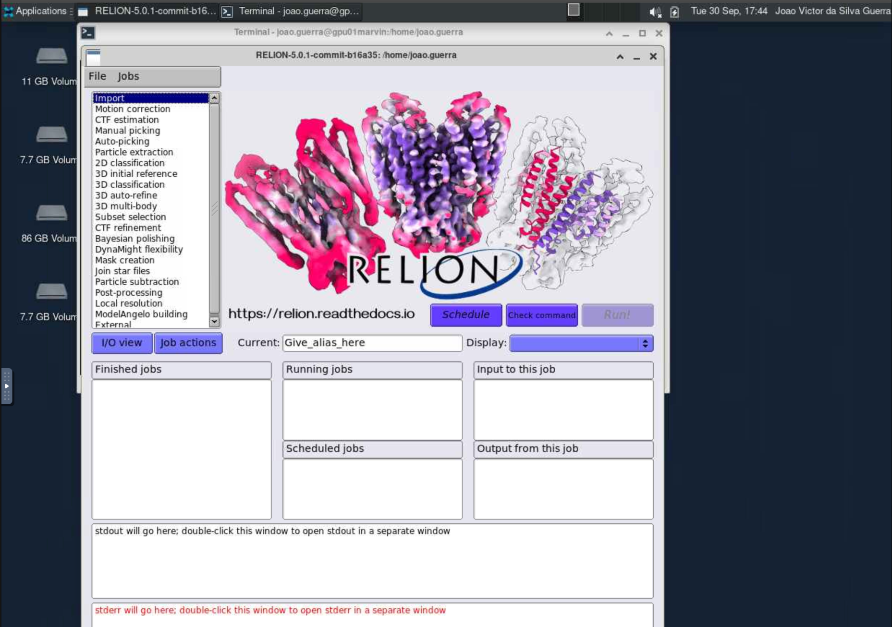

# Relion

O [Relion](https://github.com/3dem/relion) (REgularised LIkelihood OptimisatioN) é um software amplamente utilizado para o processamento de dados de microscopia eletrônica de partículas únicas (cryo-EM). Ele implementa métodos estatísticos avançados para a reconstrução tridimensional de estruturas moleculares a partir de imagens bidimensionais, permitindo a obtenção de mapas de alta resolução. O Relion é conhecido por sua capacidade de lidar com grandes conjuntos de dados e por sua abordagem robusta para a classificação e refinamento de partículas.

Para mais informações sobre o Relion, acesse <https://relion.readthedocs.io/en/release-5.0/>.

## Carregando o módulo

O RELION está disponível dentro do módulo `scipion`. Para utilizá-lo no HPCC Marvin, você deve carregar o módulo `scipion`:

```bash
module load scipion
```

Para acessar a documentação do modulo, utilize:

```bash
module help scipion
```

## Como executar o Relion no Open OnDemand

Para executar o Relion, são necessários os seguintes passos:

1. Acesse o Open OnDemand do HPCC Marvin em <https://marvin.cnpem.br/>.

2. Em `Interactive Apps`, abra uma `VNC`.

3. No formulário da VNC, selecione uma das partições `gui-gpu-small` ou `gui-gpu-big` e defina o número de horas, número de GPUs e número de CPUs conforme necessário. Clique em `Launch`.

4. Uma nova janela será aberta com a VNC. Aguarde até que a VNC esteja ativa (`Running`) e clique em `Launch VNC`.

5. Uma vez que a VNC estiver ativa, abra um terminal dentro da VNC.

6. No terminal, execute o seguinte comando para iniciar o Scipion:

```bash
# Habilitar o módulo
module load scipion
# Iniciar o Relion com interface gráfica
relion
```
<center>
    
</center>

Para mais detalhes sobre os parâmetros do Relion, use:

```bash
relion --help
```
