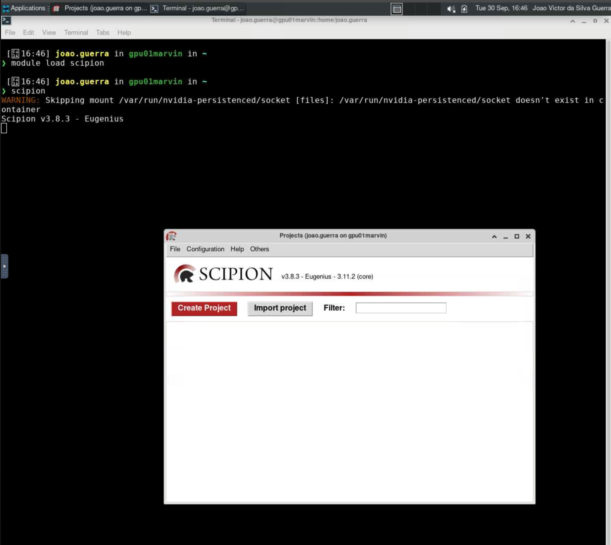

# Scipion

O [Scipion](https://scipion.i2pc.es/) é uma plataforma de software integrada para processamento de dados de microscopia eletrônica de partículas únicas e tomografia (Cryo-EM). Ele fornece uma interface unificada para vários pacotes de software, facilitando o fluxo de trabalho desde a aquisição de dados até a reconstrução 3D e análise estrutural.

Para mais informações sobre o Scipion, acesse <https://scipion-em.github.io/docs/release-3.0.0/index.html>.

## Carregando o módulo

## Carregando o módulo

Para habilitar o Scipion no HPCC Marvin, você deve carregar o módulo `scipion`:

```bash
module load scipion
```

<div class="warning">
    <br>As versões disponíveis do Scipion no HPCC Marvin são:
    <ul>
        <li><code>scipion/3.8.3     (D)</code></li>
        <li><code>scipion/3.0.12</code></li>
    </ul>
    Onde <code>(D)</code> indica a versão padrão.
    <p>A versão <code>scipion/3.8.3</code> inclui outros programas integrados, como:
        <a href="../3dmod/index.html" target="_blank"><code>3dmod</code></a>,
        <a href="../cistem/index.html" target="_blank"><code>cisTEM</code></a>,
        <a href="../etomo/index.html" target="_blank"><code>Etomo</code></a>,
        <a href="../isonet/index.html" target="_blank"><code>IsoNet</code></a>,
        <a href="../phenix/index.html" target="_blank"><code>Phenix</code></a> e
        <a href="../relion/index.html" target="_blank"><code>Relion</code></a>.
    </p>
</div>

Para acessar a documentação do modulo, utilize:

```bash
module help scipion
```

## Como executar o Scipion no Open OnDemand

Para executar o Scipion, são necessários os seguintes passos:

1. Acesse o Open OnDemand do HPCC Marvin em <https://marvin.cnpem.br/>.

2. Em `Interactive Apps`, abra uma `VNC`.

3. No formulário da VNC, selecione uma das partições `gui-gpu-small` ou `gui-gpu-big` e defina o número de horas, número de GPUs e número de CPUs conforme necessário. Clique em `Launch`.

4. Uma nova janela será aberta com a VNC. Aguarde até que a VNC esteja ativa (`Running`) e clique em `Launch VNC`.

5. Uma vez que a VNC estiver ativa, abra um terminal dentro da VNC.

6. No terminal, execute o seguinte comando para iniciar o Scipion:

```bash
# Habilitar o módulo
module load scipion
# Iniciar o Scipion com interface gráfica
scipion
```

<center>
    
</center>

Para mais detalhes sobre os parâmetros do Scipion, use:

```bash
scipion --help
```
