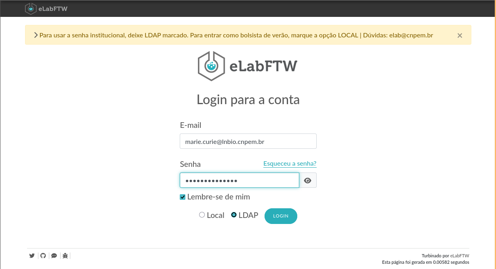

# eLab

Esta seção apresenta o caderno eletrônico de laboratório eLab, que está disponível em <https://elab.cnpem.br>.

O [eLab](https://www.elabftw.net/) é um caderno eletrônico de laboratório (ELN) de código aberto, amplamente utilizado na comunidade científica para o registro e organização de dados experimentais. Ele permite que os pesquisadores documentem seus experimentos, compartilhem informações e colaborem de forma eficiente.

<div class="warning">
⚠️ O eLab não está hospedado no HPCC Marvin. Trata-se de um serviço institucional, operado em uma máquina virtual gerenciada pela DTI (Divisão de Tecnologia da Informação) do CNPEM.
</div>

Para solicitar suporte ou ajuda com o eLab, registre um chamado na <a href="https://cnpem.atlassian.net/servicedesk/customer/portal/181" target="_blank">[LNBio] Suporte EDB</a> do Jira em <a href="https://cnpem.atlassian.net/servicedesk/customer/portal/181/group/536/create/2157" target="_blank">eLab: Suporte ao usuário</a>.

## Acesso pelo navegador </img>

Para acessar o eLab pelo navegador, abra seu navegador e acesse:

```bash
https://elab.cnpem.br
```

<div class="warning">
Lembre-se que este endereço só funcionará na rede interna do CNPEM. Para acessá-lo de fora do centro, é necessário usar a VPN. Caso não tenha este acesso à VPN, entre em contato com o <strong>DTI</strong>.
</div>

Na tela de login, use seu e-mail e senha institucional.

<div class="warning">
Se você é a Marie Skłodowska-Curie, seu email é <code>marie.curie@lnbio.cnpem.br</code>.
</div>

<center>
    
</center>
