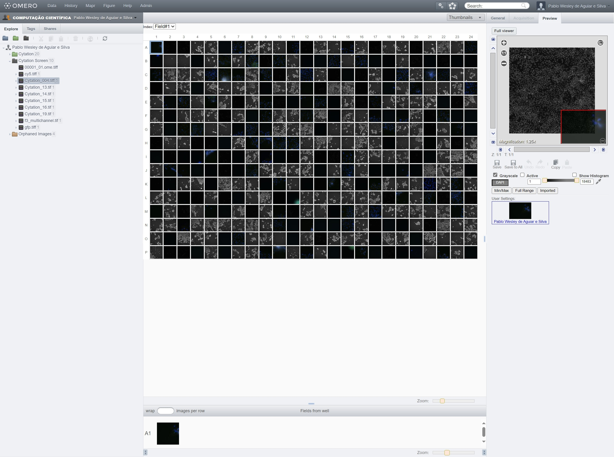

# OMERO

Esta seção apresenta o repositório de imagens OMERO do LNBio, que está disponível em <https://omero-lnbio.cnpem.br>. 

O [OMERO](https://www.openmicroscopy.org/omero/) é um sistema de gerenciamento de imagens científicas desenvolvido pelo Open Microscopy Environment (OME), que é uma plataforma de código aberto amplamente utilizada na comunidade científica para o armazenamento, visualização e compartilhamento de imagens de microscopia.

Para solicitar suporte ou ajuda com o OMERO, registre um chamado na <a href="https://cnpem.atlassian.net/servicedesk/customer/portal/181" target="_blank">[EDB] Central de serviços de dados</a> do Jira em <a href="https://cnpem.atlassian.net/servicedesk/customer/portal/181/group/536/create/2156" target="_blank">OMERO: Suporte ao usuário</a>.

## Acesso pelo navegador </img>

Para acessar o OMERO pelo navegador, abra seu navegador e acesse:

```bash
https://omero-lnbio.cnpem.br
```

<div class="warning">
Lembre-se que este endereço só funcionará na rede interna do CNPEM. Para acessá-lo de fora do centro, é necessário usar a VPN. Caso não tenha este acesso à VPN, entre em contato com o <strong>DTI</strong>.
</div>

Na tela de login, use seu usuário (sem `@lnbio.cnpem.br`) e senha institucional.

<div class="warning">
Se você é a Marie Skłodowska-Curie, seu email é <code>marie.curie@lnbio.cnpem.br</code>. Logo, seu usuário é <code>marie.curie</code>.
</div>

<center>
    
</center>

Após o login, você verá a interface web do OMERO:

<center>
    
</center>

## Acessando grupos

Após realizar o login, você poderá selecionar o grupo de trabalho no qual deseja navegar.

No canto superior esquerdo da interface, clique no ícone de 👥 (grupos) para listar todos os grupos dos quais você faz parte. Ao passar o mouse sobre um grupo, os usuários pertencentes a ele serão exibidos.

<center>

</center>

Ao clicar sobre um usuário dentro de um grupo, você poderá **visualizar, anotar ou editar** imagens, dependendo das permissões configuradas para aquele grupo. Por padrão, os grupos permitem apenas visualização.

<center>

</center>
