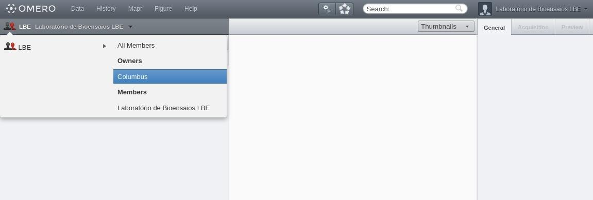
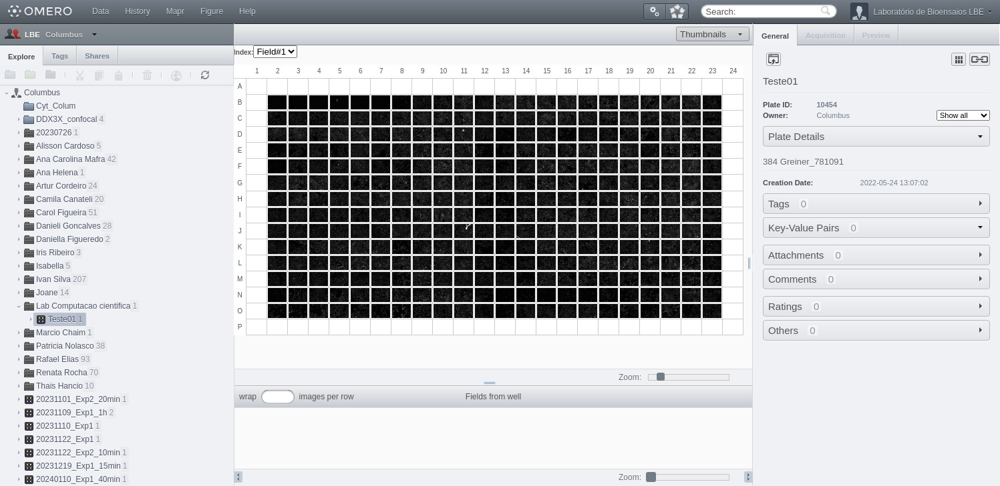

## Acessando os grupos

Após realizar o login, você poderá selecionar o grupo de trabalho no qual deseja navegar.

No canto superior esquerdo da interface, clique no ícone de 👥 (grupos) para listar todos os grupos dos quais você faz parte. Ao passar o mouse sobre um grupo, os usuários pertencentes a ele serão exibidos.

Ao clicar sobre um usuário dentro de um grupo, você poderá **visualizar, anotar ou editar** imagens, dependendo das permissões configuradas para aquele grupo. Por padrão, os grupos permitem apenas visualização.

