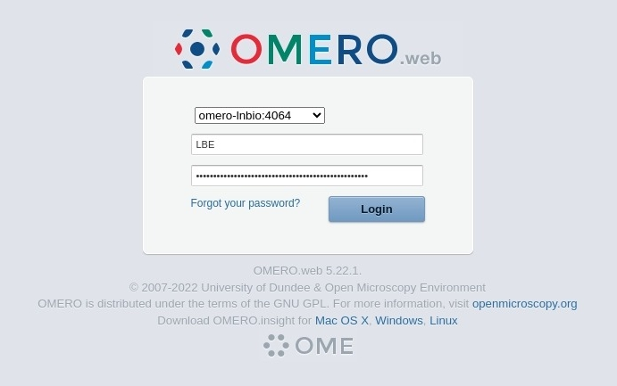

## Acesso pelo navegador 

Para acessar o OMERO pelo navegador, abra seu navegador e acesse:

```bash
https://omero-lnbio.cnpem.br
```

<div class="warning">
Lembre-se que este endereço só funcionará na rede interna do CNPEM. Para acessá-lo de fora do centro, é necessário usar a VPN. Caso não tenha este acesso à VPN, entre em contato com o <strong>DTI</strong>.
</div>

Na tela de login, use seu usuário (sem `@lnbio.cnpem.br`) e senha institucional.

<div class="warning">
Se você é a Marie Skłodowska-Curie, seu email é <code>marie.curie@lnbio.cnpem.br</code>. 
Logo, seu usuário é <code>marie.curie</code>.
</div>

<center>
    
</center>

Após o login, você verá a interface web do OMERO:

<center>
    
</center>
