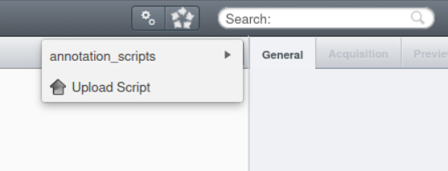
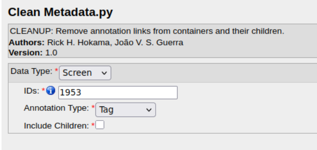
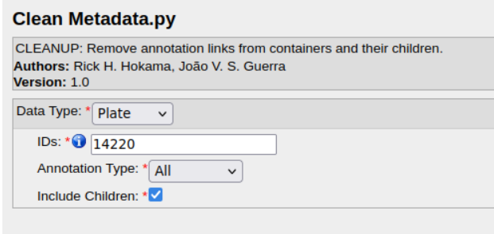
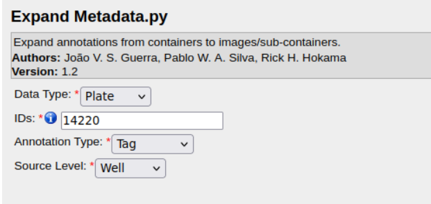

# Executando scripts no OMERO

Dentro do OMERO web, é possível executar scripts para realizar diversas tarefas, como processamento de imagens, manipulação das anotações, importação e exportação de dados etc.

Para acessar o menu de scripts, clique no ícone com duas engrenagens no canto superior direito, ao lado da barra de busca.

    

Dentro do menu, os scripts estarão disponíveis dentro de suas categorias. Atualmente, contamos apenas com a categoria de anotações, `annotation_scripts`.

> Selecione o objeto alvo antes de abrir o script, e os campos de tipo do dado e ID do objeto serão preenchidos automaticamente.

Após preencher os parâmetros obrigatórios, clique em `Run Script` no canto inferior direito para executar o script. O resultado da execução do script será exibido na tela, e, caso haja algum erro, uma mensagem de erro será exibida.

## Scripts de anotações

São scripts que permitem a manipulação das anotações dos objetos do OMERO de forma automatizada. Com isso, é possível limpar tags, key-value pairs, comentários, anexos etc. de forma rápida e fácil, sem a necessidade de acessar cada objeto individualmente.

Uma vez que a anotação das imagens é essencial pois os metadados associados são utilizados nos fluxos de análise, o apoio dos scripts é imprescindível para manter a organização e garantia de que todos os dados estejam corretamente anotados.

### Clean Metadata

O script `Clean Metadata.py` é um script que permite a limpeza das anotações dos objetos do OMERO. Ele é capaz de limpar tags, key-value pairs, comentários e arquivos anexos de forma rápida e fácil. Além de limpar os metadados de um alvo, é possível deletar também as anotações de todos os objetos filhos.

**Parâmetros**:

- `Data Type`: Selecione o tipo de objeto do OMERO que deseja selecionar como alvo do script de limpeza.
- `ID`: Insira o ID do objeto do OMERO que deseja selecionar como alvo do script de limpeza. É possível inserir mais de um ID, separando-os por vírgula.
- `Annotation Type`: Selecione o tipo de anotação que deseja limpar (*All* para todos).
- `Include Children`: Marque o checkbox caso deseje limpar as anotações dos objetos filhos do alvo selecionado.

No exemplo da imagem abaixo, as tags do objeto do tipo *Screen*, cujo ID é 1953, seriam limpas. Porém, os *Plates*, *Wells* e *Images* filhos do *Screen* não teriam suas tags removidas.

    

Já no próximo exemplo, todas as anotações do *Plate* com ID 14220 seriam limpas e, como o checkbox de incluir os filhos está marcado, as anotações dos *Wells* e *Images* filhos do *Plate* também seriam excluídas.

    

### Expand Metadata

O script `Expand Metadata.py` é um script que permite a expansão das anotações dos objetos do OMERO. Quase como um oposto do script de limpeza, ele é capaz de copiar as anotações de um objeto do OMERO para seus objetos filhos. Com isso, é possível garantir que os metadados estejam corretamente anotados em todos os níveis hierárquicos dos objetos do OMERO, sem ter que preencher um por um.

Por exemplo, ao invés de anotar uma centena de *Wells* e *Images* com uma tag `XYZ`, é possível anotar apenas o *Plate* pai com a tag `XYZ` e, em seguida, usar o script de expansão para copiar essa tag para todos os *Wells* e *Images* filhos.

**Parâmetros**:

- `Data Type`: Selecione o tipo de objeto do OMERO que deseja selecionar como alvo do script de expansão.
- `ID`: Insira o ID do objeto do OMERO que deseja selecionar como alvo do script de expansão. É possível inserir mais de um ID, separando-os por vírgula.
- `Annotation Type`: Selecione o tipo de anotação que deseja expandir (*All* para todos).
- `Source Level`: Defina de onde o script deve ler as anotações para começar a cópia. 

Com os parâmetros da imagem abaixo, as tags do objeto do tipo *Screen*, cujo ID é 1953, seriam copiadas para os objetos filhos do tipo *Plate*, *Well* e *Image*.

    

No exemplo seguinte, as tags dos *Wells* pertencentes ao *Plate* com ID 14220 seriam copiadas para os *Images* filhos dos *Wells* do *Plate* selecionado.

    

