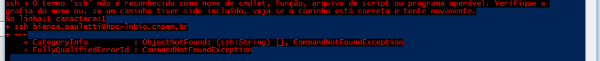
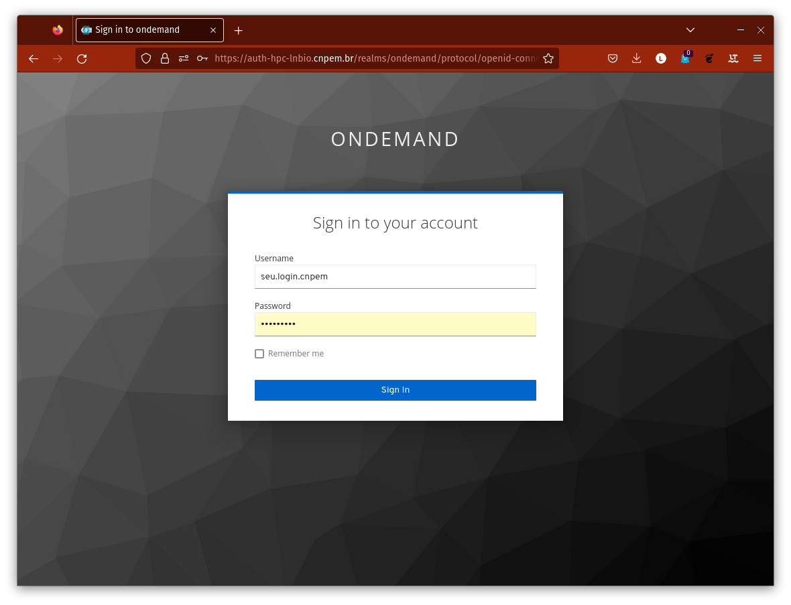
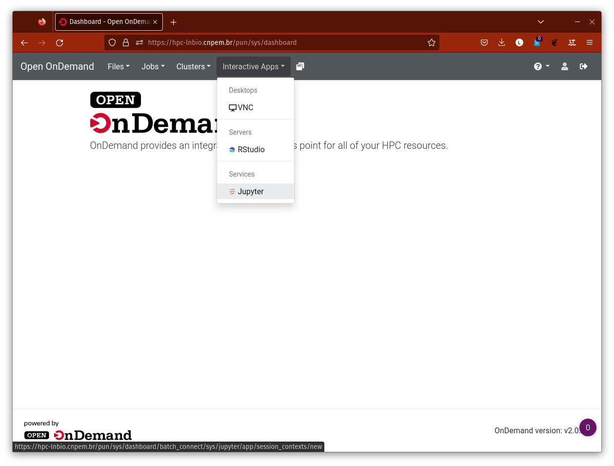

# Primeiros Passos

Antes de começar a utilizar o HPC Marvin, é importante seguir alguns passos iniciais para garantir que tudo esteja configurado corretamente. Este capítulo irá guiá-lo(a) pelos primeiros passos necessários para começar a utilizar o sistema.

Para ativar seu usuário no sistema no HPC Marvin é preciso, fazer um primeiro acesso via terminal no `ssh` (Secury SHell), que é um protocolo de rede seguro que permite a comunicação com servidores remotos. Para se conectar ao sistema, siga as instruções abaixo.

Nos tutoriais, utilizaremos o <> para indicar variáveis. Sempre que aparecer algo entre <>, subistitua pelo valor adequado, (sem digitar o <>).

_Exemplo_: Se você é a Marie Skłodowska-Curie e seu usuário é marie.curie, ao ver `<seu.login.cnpem>@lnbio.cnmpem.br`, digite `marie.curie@lnbio.cnpem.br` para executar.

## Primeiro Acesso🚪

Primeiramente, abra o terminal. 
 - Windows: abra o PowerShell <br>
 - Linux e MacOS: abra o terminal <br>

Nele vamos usar o `ssh` para acessar o *cluster*, então digite o seguinte comando:<br>
```
ssh <seu.login.cnpem>@hpc-lnbio.cnpem.br
```

Caso esteja no Windows, pode ser que apareça o seguinte erro:
<center>
  <br>
</center>

Se ocorrer tente outro computador ou peça para o **TIC** instalar o **ssh** na máquina que você está usuando.

Continuando, digite a sua senha **institucional** quando solicitada.
Observe que, dependendo do seu terminal, pode ser que nada apareça na tela quando você digitar a senha por motivos de segurança. Isso é normal. Se você errar, tente novamente.

É possível que um aviso com os dizeres semelhantes aos abaixo apareça
```
[...] Are you sure you want to continue connecting (yes/no/[fingerprint])?
```
Digite `yes` e aperte **enter**

Se tudo ocorreu bem, você verá o cursor piscando no terminal com dizeres similares ao seguinte:

```
[<seu.login.cnpem>@marvin ~]$
```

Ao digitar o comando ls para listar o conteúdo do diretório, você verá que já está criada uma pasta chamada ondemand. Verifique por favor...

## Acesso pelo navegador 

Agora vamos ao seu navegador 

Na barra de endereços entre no seguinte site

```
https://hpc-lnbio.cnpem.br
```
Lembre-se, este site só estará disponível na rede interna, se você estiver em casa é preciso usar a **VPN**. Caso não tenha este acesso à VPN, favor solicitar à **TIC**.

No site acessado, mais uma vez, será preciso logar com o sua **senha institucional**.</br>
(Não é preciso colocar o email completo, o que vem antes do @ é o suficiente)
<center>
    
</center>

Se tudo der certo você verá a tela abaixo:

<center>
    
</center>

### IMPORTANTE
Após este primeiro login você já está apto a ver e gravar arquivos na aba `Files` do Open OnDemand (ood), mas ainda não vai conseguir criar jobs ou usar o `Interactive Apps`.

Por hora esta autorização é feita manualmente, então assim que precisar mande um email para um destes endereços (ou chame via TEAMS)

### ATENÇÃO, DEPOIS DE FEITO O PRIMEIRO LOGIN, SE QUISER É POSSÍVE USAR APENAS VIA NAVEGADOR!

## Vídeo Resumo

<!-- (vou regravar em FullHD, mas por enquanto vou deixar aqui para receber feedbacks sobre o formato) -->

<figure class="video_container">
  <video controls="true" allowfullscreen="true" poster="png/thumb_1st.png" width="852" height="480">
    <source src="videos/1stlogin.mp4" type="video/mp4">
  </video>
</figure>

<!-- ## Configuração do Ambiente de Trabalho

Após conectar-se ao HPC Marvin, você precisará configurar seu ambiente de trabalho. Isso inclui a instalação de softwares adicionais que você possa precisar para sua pesquisa e a configuração de variáveis de ambiente. Para configurar seu ambiente de trabalho, siga as instruções fornecidas abaixo:

1. Instale os softwares necessários para sua pesquisa
2. Defina as variáveis de ambiente necessárias, como $PATH, $LD_LIBRARY_PATH, etc. -->

## Transferência de Arquivos 📁💻 

Para começar a utilizar o HPC Marvin, você precisará transferir seus arquivos para o sistema. Isso pode ser feito de várias maneiras, como usando o comando `scp` (secure copy) ou usando um cliente FTP (File Transfer Protocol). Para transferir seus arquivos, siga as instruções fornecidas abaixo:

1. Abra um terminal em seu computador
2. Use o comando `scp` ou um cliente FTP para transferir seus arquivos para o sistema

Completar essas etapas iniciais é essencial para garantir que você possa utilizar o HPC Marvin de forma eficiente. Se você tiver alguma dúvida ou precisar de ajuda, não hesite em entrar em contato com a equipe de suporte do sistema.
