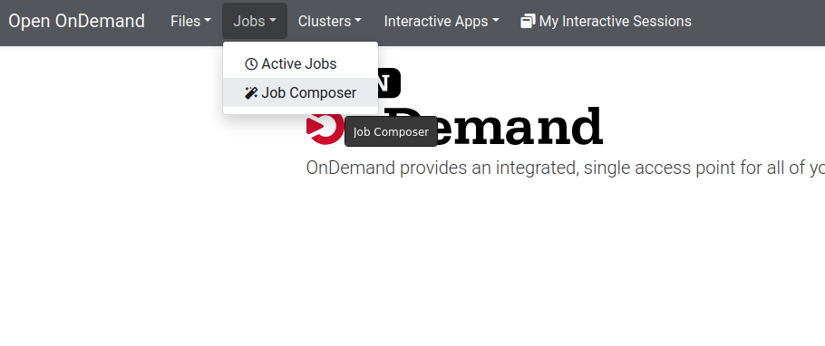
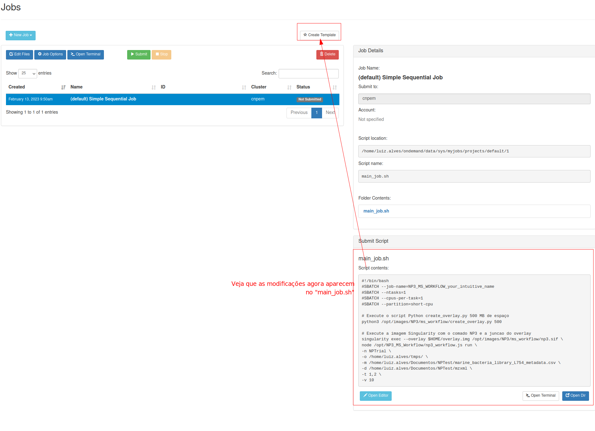
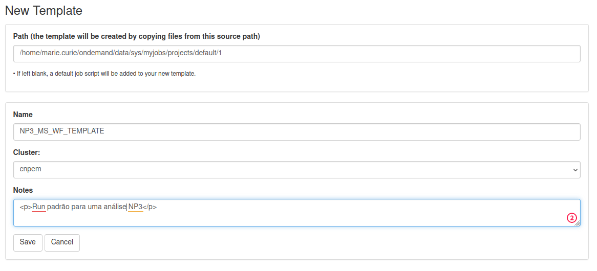
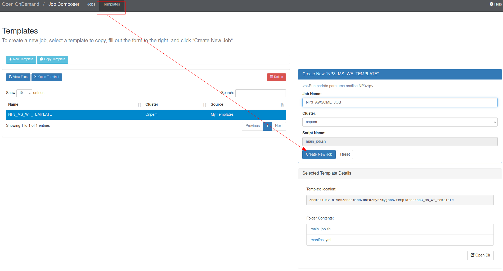
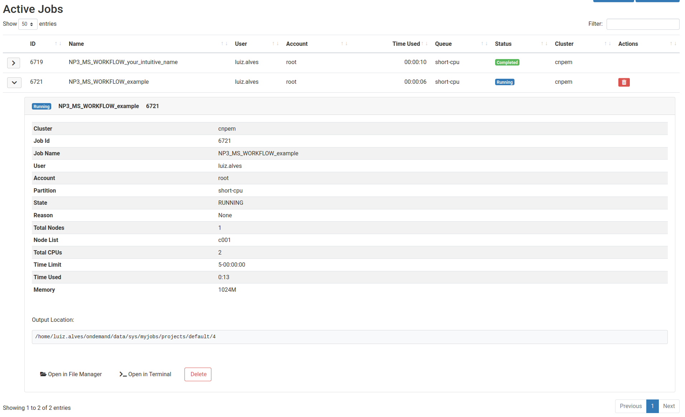

# Usando o Job Composer do Onpen OnDemand (OOD)

O Open OnDemand é uma plataforma permite aos usuários executar aplicativos e jobs em sistemas de cluster remotos. Com o Job Composer, um componente integrado da plataforma Open OnDemand, os usuários podem facilmente criar e enviar jobs para o sistema de gerenciamento de fila. Neste tutorial passo a passo, você terá um exemplo de como usar o Job Composer para criar jobs para executar o NP³ MS_WORKFLOW.

1. Na interface inicial do OOD, após o login, entre na seção Job Composer dentro da aba jobs para acessar a ferramenta.

2. Clique no botão "New Job" na parte superior esquerda da tela para criar uma nova tarefa.
Você pode escolher um template padrão ou um pré-criado. Para este exemplo, vamos no "From Default Template".

3. A direita da tela, você verá os quadros "Job Details" e "Submit Script" com os detalhes do arquivo padrão. Para modificá-lo e preenchê-lo, clique em "Open Editor" e abra o editor de texto (provavelmente ele virá em uma nova aba).

4. Aqui você terá um editor de texto onde poderá escrever os detalhes da sua tarefa. Realize as modificações necessárias e clique em **Save** no canto superior esquerdo, em seguida feche a aba.

5. Se você for realizar tarefas semelhantes no futuro, é uma boa ideia criar um template. Para fazer isso, clique no botão "Create Template".

    - 5.1. Preencha ou modifique os dados do fomulário e clique em **Save**
    

    - 5.2 Agora você poderá criar tarefas a partir deste template padrão, realizando apenas as modificações necessárias como visto nos itens 3 e 4.
    

6. Voltando ao Job Composer, agora é escolher e conferir o job criado (fazendo mais alterações se necessário) e clicar no botão verde **>Submit**.

7. Você pode acompanhar o status do seu job na seção "Active Jobs" na aba "Jobs". Aqui, você pode ver uma lista de todos os jobs ativos e já concluídos.

8. Para ver a saída do terminal durante o processamento do job, clique no botão **Open in File Manager**. Esta saída estará escrita no arquivo "slurm-xxxx.out".

9. E os arquivos gerados pelo processamento do NP³? Eles estarão na pasta indicada pelo parâmetro "-o" ou "--output_path" no RUN submetido.
