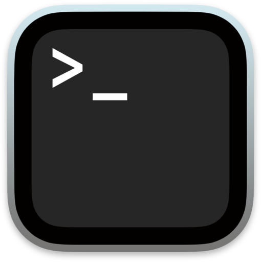
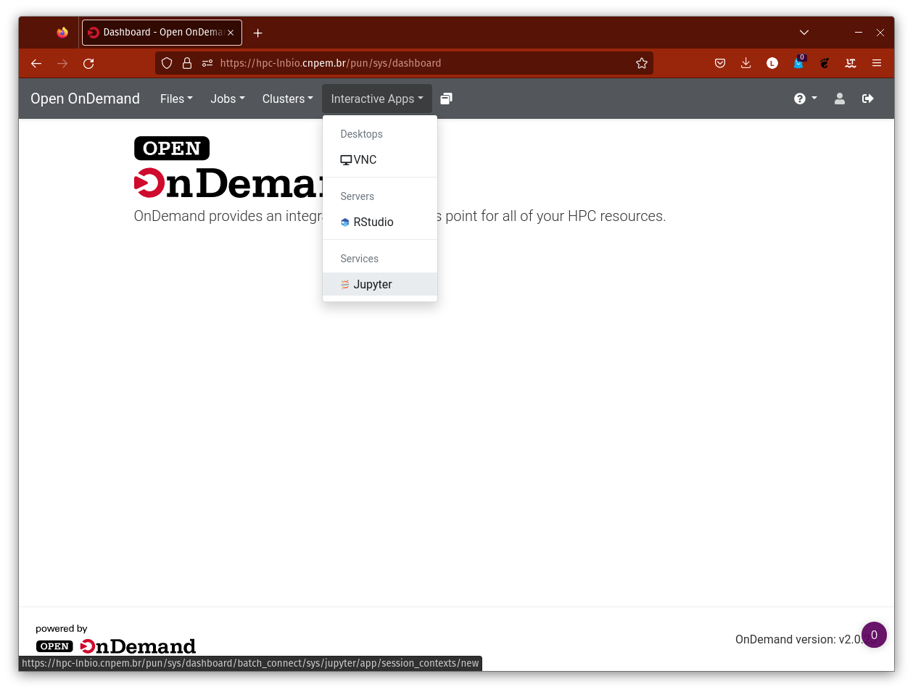

# Primeiros Passos

Antes de começar a utilizar o HPC Marvin, é importante seguir alguns passos iniciais para garantir que tudo esteja configurado corretamente. Este capítulo irá guiá-los pelos primeiros passos necessários para começar a utilizar o sistema.

Para ativar seu usuário no Marvin é preciso fazer um primeiro acesso via `ssh` (Secury SHell), que é um protocolo de rede seguro que permite a comunicação com servidores remotos. Para se conectar ao sistema, siga as instruções abaixo.

Nos tutoriais, utilizaremos o <> para indicar variáveis. Sempre que aparecer algo entre <>, subistitua pelo valor adequado, (sem digitar o <>).

_Exemplo_: Se você é a Marie Skłodowska-Curie e seu usuário é marie.curie, ao ver `<seu.login.cnpem>@lnbio.cnmpem.br`, digite `marie.curie@lnbio.cnpem.br` para executar.

<div class="warning">

IMPORTANTE

Após o primeiro login, você já está apto a ler e gravar arquivos na aba `Files` do Open OnDemand (ood), mas **ainda não irá conseguir criar jobs, submeter jobs ao SLURM ou usar o `Interactive Apps`.**

A autorização é feita manualmente. Peça por email ou pelo Teams para um dos administradores:

- **Via Teams**
  - Pablo Wesley - `pablo.silva@lnbio.cnpem.br`
  - João Guerra - `joao.guerra@lnbio.cnpem.br`
  - José Geraldo - `jose.pereira@lnbio.cnpem.br`

- **Via Email**
  - `edb@lnbio.cnpem.br` com o assunto **Recursos HPC-Marvin**

</div>

## Primeiro Acesso🚪

Para acessar o HPC Marvin, comece abrindo o terminal. Se estiver usando Windows, abra o PowerShell </img>; se estiver usando Linux ou MacOS, abra o terminal </img>. Para acessar o HPC Marvin, use o comando:

```bash
ssh <seu.login.cnpem>@marvin.cnpem.br
```

Se estiver no Windows e receber o seguinte erro, tente usar outro computador ou peça ajuda ao TIC para instalar o `ssh`.

```PowerShell
ssh: O termo 'ssh' não é reconhecido como nome de cmdlet, função, arquivo de script
ou programa operável. Verifique a grafia do nome ou, se um caminho tiver sido incluído,
veja se o caminho está correto e tente novamente.
Na linha:1 caractere:1
+ ssh marie.curie@marvin.cnpem.br
+ ~~~
    + CategoryInfo          : ObjectNotFound (ssh:String) [], CommandNotFoundException
    + FullyQualifiedErrorId : CommandNotFoundException
```

Quando solicitado, digite sua **senha institucional**. Dependendo do seu terminal, você pode não ver nada na tela quando digita sua senha por motivos de segurança. Isso é normal. Se cometer algum erro, tente novamente.

Você pode receber um aviso solicitando sua confirmação antes de continuar conectando.

```bash
[...] Are you sure you want to continue connecting (yes/no/[fingerprint])?
```

Digite `yes` e pressione **enter**. Se tudo correu bem, você verá o cursor piscando no terminal, com um texto semelhante a:

```bash
[<seu.login.cnpem>@marvin ~]$
```

Digite o comando `ls` para verificar o conteúdo do diretório, e você deverá ver uma pasta chamada "ondemand". Confirme se a pasta está presente.

## Acesso pelo navegador </img>

IMPORTANTE: o acesso pelo navegador funcionará apenas após um primeiro acesso via `ssh` (ver [Primeiro Acesso](##primeiro-acesso)).

Para acessar o cluster pelo navegador, abra o seu navegador e digite o seguinte endereço na barra de endereços:

```
https://marvin.cnpem.br
```

Lembre-se, este site só estará disponível na rede interna. Para acessá-lo de fora do centro, é necessário usar a **VPN**. Caso não tenha este acesso à VPN, entre em contato com o **TIC**.

Na página que abrir, faça login com a sua **senha institucional**. Você só precisa digitar o que vem antes do '@' do seu email.

<center>
    
</center>

Se tudo der certo, você verá a tela de _login_ abaixo:

<center>
    
</center>

### Vídeo Resumo

<figure class="video_container">
  <video controls="true" allowfullscreen="true" poster="videos/thumb_1st.png" width="852" height="480">
    <source src="videos/1stlogin.mp4" type="video/mp4">
  </video>
</figure>

Completar essas etapas iniciais é essencial para garantir que você possa utilizar o HPC Marvin de forma eficiente. Se você tiver alguma dúvida ou precisar de ajuda, não hesite em entrar em contato com a equipe de suporte do sistema.
