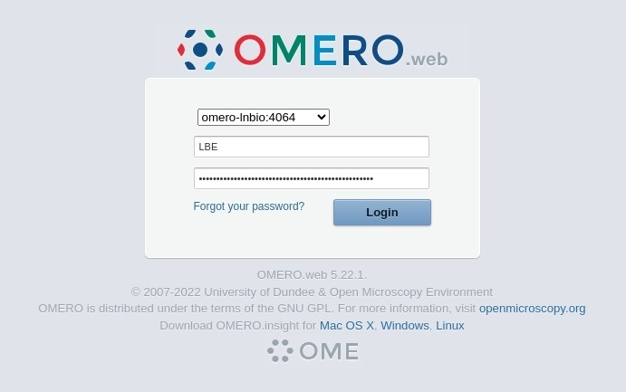
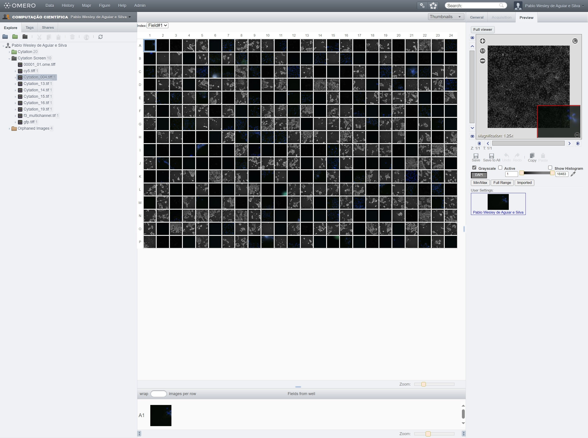
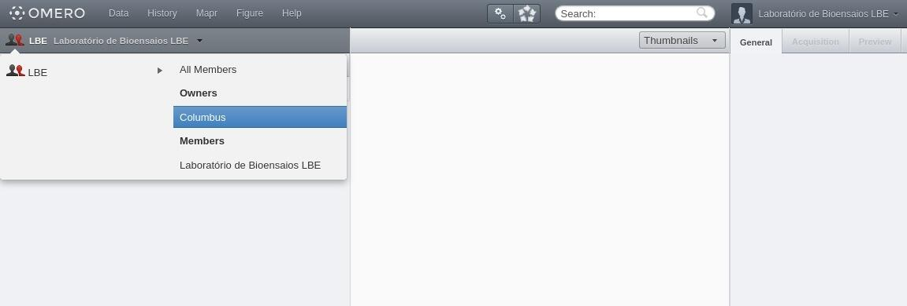
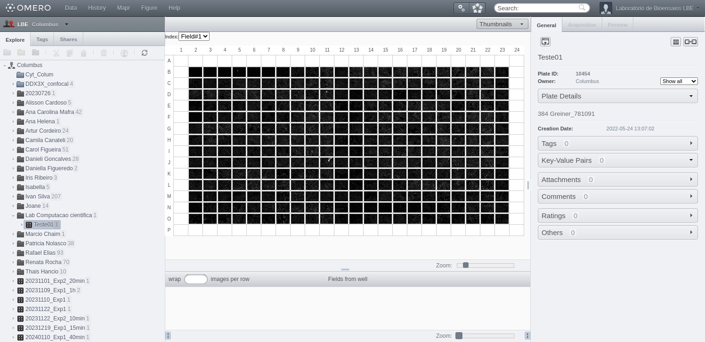

# OMERO

<p style='text-align: justify;'> 
Bem-vindo à documentação do repositório de bioimagens OMERO. Este guia foi criado para ajudar os administradores e usuários a entender como utilizar e gerenciar o sistema OMERO, que permite a visualização, organização, análise e compartilhamento de imagens de microscopia.
</p>

## Acesso pelo navegador </img>

Para acessar o OMERO, abra o seu navegador e digite o seguinte endereço na barra de endereços:

```bash
https://omero-lnbio.cnpem.br
```

Este site só estará disponível na rede interna. Para acessá-lo de fora do centro, utilize a **VPN**. Se não tiver acesso à VPN, entre em contato com o **TIC**.

Faça login com a sua **senha institucional**. Seu nome de usuário é a parte do seu e-mail antes do '@'.

**Exemplo**: Se você é a Marie Skłodowska-Curie (`marie.curie@lnbio.cnpem.br`), seu usuário é `marie.curie`.

<center>
    
</center>

Se o login for bem-sucedido, você verá a tela do _webapp_ abaixo:

<center>
    
</center>

**Observações:**

- Os logins de usuários (`marie.curie`) e dados do Columbus estão sincronizados e acessíveis pela aplicação web;

- Se este for seu primeiro acesso institucional, seu cadastro será criado automaticamente.

## Acessando grupos

Após fazer login e acessar a página de visualização de arquivos, você verá no canto superior esquerdo um icone de duas pessoas (👥) indicando o grupo que está visualizando. Clique nele para listar todos grupos dos quais faz parte. Ao passar o mouse sobre um grupo, você verá os usuários inclusos.

As 

<center>
    
</center>

Ao clicar em um usuário, você pode visualizar, anotar ou editar imagens, dependendo das permissões do grupo. Por padrão, apenas a visualização é permitida.

<center>
    
</center>
